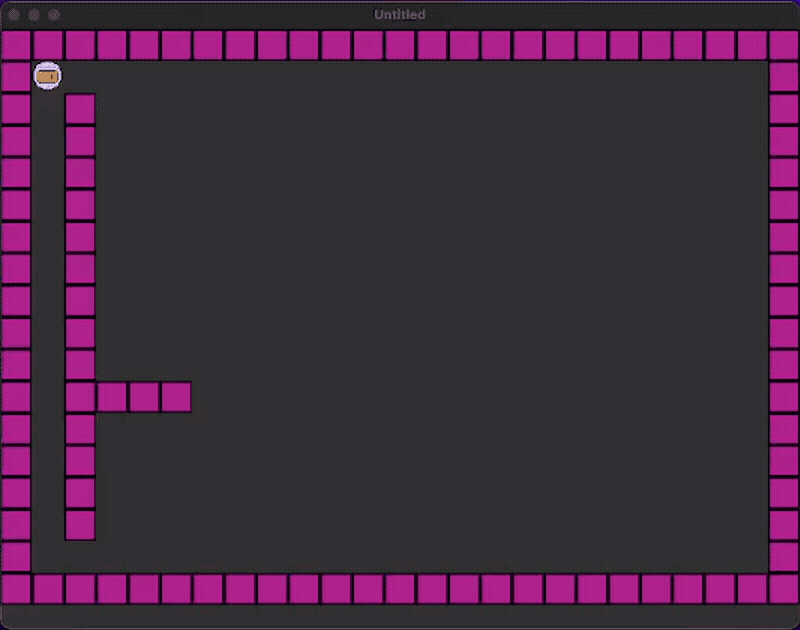

Recently, I've been heavily configuring my text editor, Neovim, which means that I've been writing a lot of Lua. I do
find it enjoyable, even without having any tooling initially, so I wanted to give game development and
[Love2D](https://love2d.org) a try. I just finished
[Sheepolution's How to LÖVE](https://www.sheepolution.com/learn/book/contents) book on Love2D, and felt prepared to make
my first game from scratch. As per Jherzey's request, I'm creating a Bomberman clone.

<!--truncate-->

I tried looking for libraries that might be useful at first, such as the ones used in
[Commando Kibbles](https://github.com/bakpakin/CommandoKibbles). I wanted to set up an Entity-Component system and all
those other fancy game dev stuff I've been hearing about. However, I realized that I should only use the ones that I
don't feel like re-writing. After all, the prerequisite to writing good code is writing bad code. In the end, _Boboman_
seems like a fitting title, because I do feel dumb writing this game.

Anyway, here's what it looks like now. You can walk around, place bombs, and those bombs explode after a set amount of
time, leaving a trail of explosion. The explosions don't go past the walls.

