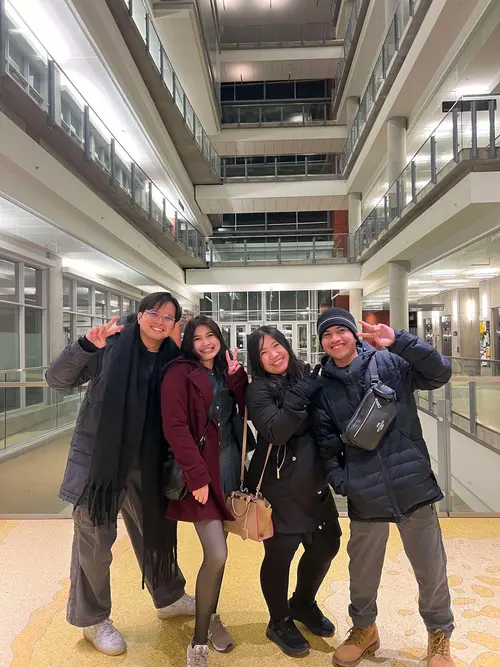
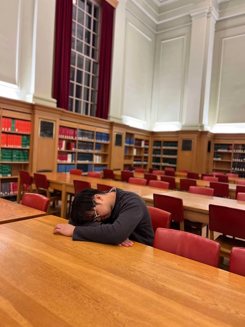

Went straight to University after meeting my friend David to tour the Gen Z gang
around the campus.

It was pretty nice to go back to the places I used to study in pre-pandemic and
tell them about it.

> "That's the exact spot where I studied for my first Math midterm. My heart was
> beating fast the whole time. Not sure if it was from nerves or from coffee"

> "We used to do labs here until 8 pm"

> "This floor used to be super loud pre-pandemic. Now it's so quiet despite
> being a collaborative zone"

> "I used to sleep over in that room the night before final exams. Sometimes I
> just stayed because I felt like it"

> "We used to drink in that bar over there every single week, no fail"

Not sure if newer students starting now would be able to do stuff that I've done
before. Makes me wonder what other people did in the past that we weren't
allowed to do anymore when I started university.

