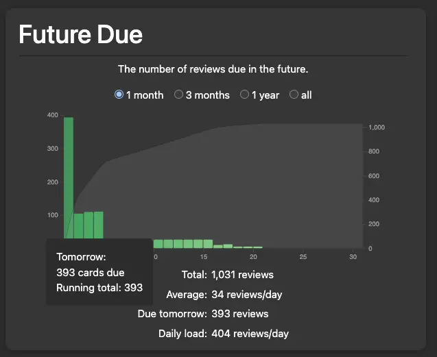

Drinking black coffee every day was starting to give me mouth sores. I had to
use powdered creamer today.

Remember a few days ago when I said I was going to limit Anki time? I failed to
stop myself again.

To be fair, probably half of flashcard time today was spent making dim sum
flashcards. I actually had to do some research in Cantonese wikipedia because
some of the [items](https://www.cantonese.sheik.co.uk/dimsum1.htm) had weird or
missing translations.

The most interesting ones were 香菇四寶扎 (_hoeng1 gu1 sei3
bou2 zaat3_) and 荷葉珍珠雞 (_ho4 yip6 zan1 zyu1 gai1_). I actually had to use ChatGPT for them which led me to
[四寶雞扎](https://zh-yue.wikipedia.org/wiki/%E5%9B%9B%E5%AF%B6%E9%9B%9E%E6%89%8E)
(_sei3 bou2 gai1 zaat3_) and
[珍珠雞](<https://zh-yue.wikipedia.org/wiki/%E7%8F%8D%E7%8F%A0%E9%9B%9E_(%E9%BB%9E%E5%BF%83)>) (_zan1 zyu gai1_).

- 四寶雞扎 ("chicken tofu skin roll") - The 四寶 ("four treasures") refer to the four key ingredients used in the filling which are chicken, ham, fish maw, and shiitake.

- 珍珠雞 ("pearl chicken")- This evolved from 糯米雞 (_no6 mai5 gai1_, "sticky rice chicken") which were too large to serve in dim sum.

Dim sum lore goes hard.
