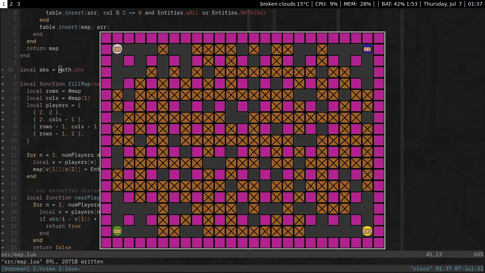

I feel like the hardest part of writing this game would be the enemy logic. That's why I'm putting it off for as long as
possible! Today I implemented map generation, randomly placing boxes sufficiently far enough from players.

I also added controls for other players, which reminded me of my local multiplayer experience with Boxhead. I miss
having multiple people on play a single keyboard. These days it would be awkward to play that way.
