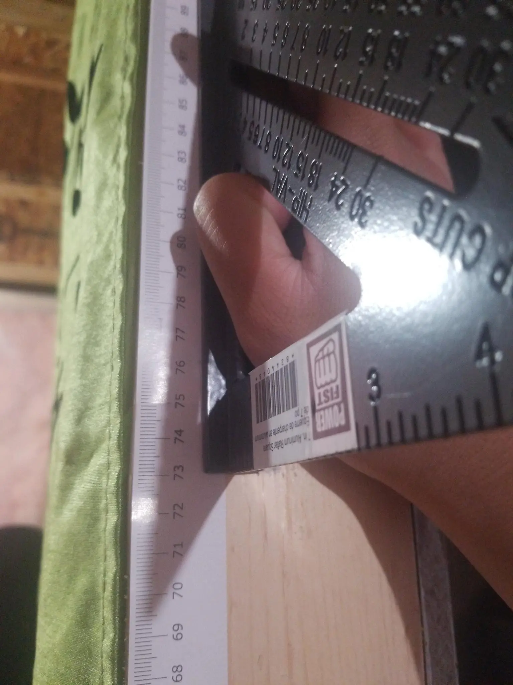

Today I learned what my actual height was (at least at the time of writing). For a few years now I've always kind of
just stuck with 170 cm because that's what was in my driver's license when I got it 5 years ago (I really need to pass
the road test this year). I'm not even sure if that was right at the time.

<!--more-->

So, I took a couple of IKEA measuring tapes (courtesy of Jherzey), put them together on a post in our basement, got a
square ruler (triangular? (\*sigh\*...
[_eskwala_](https://philnews.ph/2021/06/10/eskwala-in-english-translate-eskwala-in-english/))) and measured my height.

So I guess I grew 3 cm in those 5 years? I still haven't caught up to my dad's peak height (176 cm), but he's a bit
shorter now that he's older, so it's okay. My hair can add at least 2 inches :joy:.
