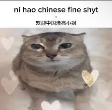

As a Canadian and a non-TikTok user, I was not exactly affected by the recent US
TikTok ban. I do, however, occasionally use Xiaohongshu, which I try to
[avoid for the same reason as I do Instagram](/post/my-worst-semester-so-far)
(it's still social media app, after all i.e. massive time sink). This last week
however, there was a huge influx of foreigners into the app which led to a lot
of interesting and wholesome interactions (and a few not-so wholesome ones).

<!-- more -->

## Breaking Down Language Barriers

It was definitely weird for both sides because of the language barrier. For some
some Americans, being thrown into an app targeted for Chinese users with little
to no localization felt like a Chinese language crash course. It also gave
Chinese users a chance to use English outside of school and an opportunity to
learn about American Internet slang (mostly TikTok slang since I didn't even
know what some of the words meant).

Americans would usually comment this sticker on posts with pretty girls:

[^1]

They did however roll out an auto-translation feature today which makes it
easier for both sides to communicate. This meant that users didn't have to keep
going back and forth between Xiaohongshu and translation apps (although Huawei
phones can record and auto-translate text in real-time, which is good for videos
without Chinese subtitles).

## Clearing Out Misconceptions

Having an actual channel for communication means that people can ask questions
to each other freely without their respective governments as the middle man (of
course, the app is still subject to Chinese laws, so none of the
[typical Chinese no-nos](https://en.wikipedia.org/wiki/Internet_censorship_in_China#Specific_examples_of_Internet_censorship)).

The most interesting one for me was how Chinese people originally perceived the
average American. They assumed that since the US is the richest country in the
world, that the average American must also be rich. They see the Americans'
monthly income converted to RMB and think that it's a lot of money[^2]. They did
not know that most Americans don't have savings and are living
paycheck-to-paycheck.

Americans are also shocked at how cheap daily necessities are in China. Even
though Chinese people make less, they often have more money left over to save.
Maybe cultural difference is still a huge factor, where most people in America
live beyond their means (850 USD/month for a monthly phone bill is crazy!!),
while saving is a big part of Chinese culture.

People now realize that we are all mostly the same. This exchange probably
changed the minds of some Chinese people who wanted to immigrate to America, and
made some Americans want to immigrate to China (of course, Chinese users shoot
that idea down; life is still hard in China).

The US government's attempt to ban TikTok has unironically brought Americans
closer to Chinese people (at least on TikTok, they weren't interacting with
Chinese people), which they most likely did not intend and are now trying to
reverse.

## TikTok is "brought back". What now?

Sometime around today, the ban was lifted from TikTok[^3]. Lots of speculations
are going around, with most people speculating that Meta has bought TikTok[^4]
because of the "new features" just after it went dark, like linking your TikTok
account to Instagram (it's been around for a while, actually, so this definitely
isn't related to the US service being restored). People's perception of TikTok
will most like not be the same (or, just like most issues, they will forget this
ever happened and go back to consuming and producing brainrot 🤷).

I do think TikTok being unbanned in the US is still a good thing for
Xiaohongshu. TikTok content creators still need to make money, after all 😉. This
means that everyone who was just looking for more traffic and not specifically
Chinese people will now leave, and those who are actually willing to stay and
communicate with Chinese people will be the only ones remaining.

The hype has also died down a bit because Chinese people have become
sleep-deprived from welcoming foreigners to the app. Most of them are also going
back home and are busy with the Spring Festival (Chinese New Year). Hopefully,
we would see more activity next week once people are back.

Overall, this is definitely a historic moment for the Internet, and the start of
a new cultural exchange. I wish the best to both the US and Chinese netizens.

EDIT: AOC's take on the mention of "President" Trump on the welcome page:

<video src="./aoc.webm" controls width="320" height="480"></video>

[^1]: The only definition of "fine shyt" I could find in Urban Dictionary that
didn't involve another slang term was "a beautiful woman".

[^2]: This is also prevalent in the Philippines. They see "$15/hour" on job
postings, convert it to PHP, and think that people with minimum-wage jobs are
living easy. They are unaware that most minimum-wage workers have to work 2 or 3
jobs just to cover food and rent.

[^3]: Thank you, President Trump, very cool! Not even in office yet and has
already "saved" TikTok.

[^4]: I tried to have ChatGPT critique this blog and got scolded for spreading
misinformation 👀 Nice to know who's already invested into TikTok (jk).
