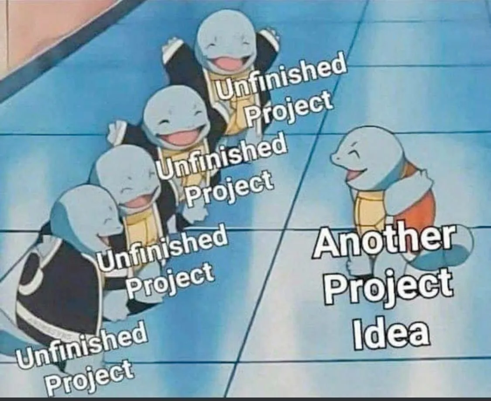

- Time Tracking PWA for my girlfriend with Svelte frontend and Pocketbase backend
  - ❓REASON: It's kinda hard to get the requirements down for this because of how complicated hourly differentials are 😭
- Web frontend for [Pincerhex](https://devpost.com/software/pincerhex), a Hex-playing program by me and my friend Will
  - written in 🦀🦀🦀 Rust 🦀🦀🦀 btw
  - [we won
    btw](https://github.com/UndergraduateArtificialIntelligenceClub/hex-tournament-2023-submissions/blob/main/games/results.md)
  - ❓REASON: I already got to show my boss at work and he got obliterated, mission accomplished
    - It's still pretty ugly, though
- Markdown to LaTeX converter for my Resume (in 🦀🦀🦀 Rust 🦀🦀🦀 btw)
  - ❓REASON: I think it's pretty much complete, but also, I haven't had to send out resumes in a while
- [Open Kattis Group
  Ranklist](https://open.kattis.com/universities/ualberta.ca) with a few extra
  columns
  - Show contributed score, and required individual score to climb the next
    group rank
  - ❓REASON: Also done, I'm just paranoid about deploying it in my home server
- Water Sort Puzzle Solver
  - ❓REASON: I uninstalled the game, too addicting

